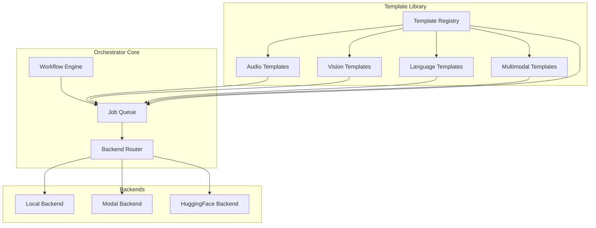
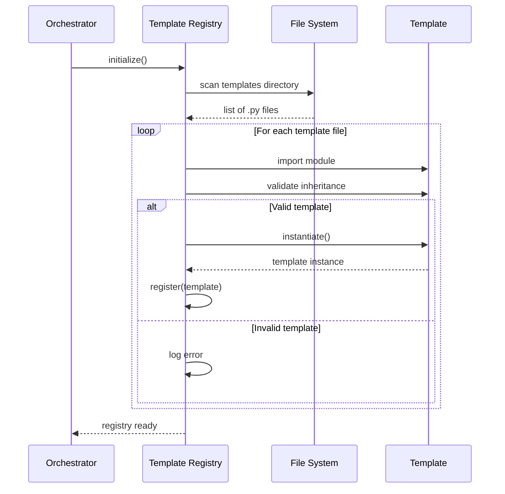
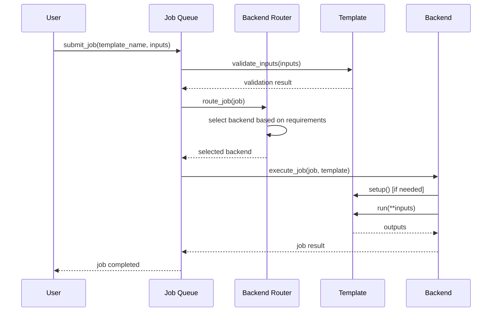

# Design Document: Template Library Expansion

## Overview

This design expands the Notebook ML Orchestrator's template library to cover four major ML domains: audio processing, vision processing, language processing, and multimodal pipelines. The expansion builds on the existing Template base class architecture and integrates seamlessly with the job queue, backend router, and workflow engine.

The design follows a plugin architecture where each template is a self-contained module that inherits from the Template base class. Templates declare their inputs, outputs, resource requirements, and supported backends. A Template Registry system discovers and registers templates automatically at startup, making them available for execution through the orchestrator's existing infrastructure.

Key design principles:
- **Modularity**: Each template is independent and self-contained
- **Discoverability**: Automatic template discovery and registration
- **Integration**: Seamless integration with existing orchestrator components
- **Extensibility**: Easy to add new templates without modifying core code
- **Documentation**: Comprehensive metadata and examples for each template

## Architecture

### High-Level Architecture



### Template Discovery Flow



### Template Execution Flow



## Components and Interfaces

### Template Registry

The Template Registry is responsible for discovering, validating, and managing all available templates.

**Class: TemplateRegistry**

```python
class TemplateRegistry:
    """
    Central registry for ML templates.
    Discovers, validates, and manages template instances.
    """
    
    def __init__(self, templates_dir: str = "templates"):
        self.templates_dir = templates_dir
        self.templates: Dict[str, Template] = {}
        self.templates_by_category: Dict[str, List[Template]] = {}
        self._lock = threading.RLock()
    
    def discover_templates(self) -> int:
        """
        Discover all templates in the templates directory.
        Returns the number of templates discovered.
        """
        pass
    
    def register_template(self, template: Template) -> bool:
        """
        Register a template instance.
        Returns True if successful, False otherwise.
        """
        pass
    
    def get_template(self, name: str) -> Optional[Template]:
        """Get a template by name."""
        pass
    
    def list_templates(self, category: Optional[str] = None) -> List[Template]:
        """List all templates, optionally filtered by category."""
        pass
    
    def get_template_metadata(self, name: str) -> Optional[Dict[str, Any]]:
        """Get metadata for a specific template."""
        pass
    
    def validate_template(self, template: Template) -> bool:
        """Validate that a template meets requirements."""
        pass
```

### Audio Processing Templates

**Speech Recognition Template**

```python
class SpeechRecognitionTemplate(Template):
    """
    Transcribes audio to text using speech recognition models.
    """
    
    name = "speech-recognition"
    category = "Audio"
    description = "Transcribe audio files to text using Whisper or similar models"
    version = "1.0.0"
    
    inputs = [
        InputField(
            name="audio",
            type="audio",
            description="Audio file to transcribe (wav, mp3, flac)",
            required=True
        ),
        InputField(
            name="language",
            type="text",
            description="Language code (e.g., 'en', 'es', 'fr')",
            required=False,
            default="en"
        ),
        InputField(
            name="model_size",
            type="text",
            description="Model size (tiny, base, small, medium, large)",
            required=False,
            default="base",
            options=["tiny", "base", "small", "medium", "large"]
        )
    ]
    
    outputs = [
        OutputField(
            name="text",
            type="text",
            description="Transcribed text"
        ),
        OutputField(
            name="segments",
            type="json",
            description="Timestamped segments with text"
        )
    ]
    
    routing = [RouteType.LOCAL, RouteType.MODAL, RouteType.HF]
    gpu_required = True
    gpu_type = "T4"
    memory_mb = 4096
    timeout_sec = 600
    pip_packages = ["openai-whisper", "torch", "torchaudio"]
    
    def run(self, **kwargs) -> Dict[str, Any]:
        """Execute speech recognition."""
        pass
```

**Audio Generation Template**

```python
class AudioGenerationTemplate(Template):
    """
    Generates audio from text using text-to-speech models.
    """
    
    name = "audio-generation"
    category = "Audio"
    description = "Generate speech audio from text using TTS models"
    version = "1.0.0"
    
    inputs = [
        InputField(
            name="text",
            type="text",
            description="Text to convert to speech",
            required=True
        ),
        InputField(
            name="voice",
            type="text",
            description="Voice ID or style",
            required=False,
            default="default"
        ),
        InputField(
            name="speed",
            type="number",
            description="Speech speed multiplier (0.5 to 2.0)",
            required=False,
            default=1.0
        )
    ]
    
    outputs = [
        OutputField(
            name="audio",
            type="audio",
            description="Generated audio file"
        )
    ]
    
    routing = [RouteType.LOCAL, RouteType.MODAL]
    gpu_required = True
    gpu_type = "T4"
    memory_mb = 2048
    timeout_sec = 300
    pip_packages = ["TTS", "torch"]
    
    def run(self, **kwargs) -> Dict[str, Any]:
        """Execute audio generation."""
        pass
```

**Music Processing Template**

```python
class MusicProcessingTemplate(Template):
    """
    Processes and analyzes music audio files.
    """
    
    name = "music-processing"
    category = "Audio"
    description = "Analyze and process music audio (tempo, key, beats)"
    version = "1.0.0"
    
    inputs = [
        InputField(
            name="audio",
            type="audio",
            description="Music audio file to process",
            required=True
        ),
        InputField(
            name="analysis_type",
            type="text",
            description="Type of analysis (tempo, key, beats, all)",
            required=False,
            default="all",
            options=["tempo", "key", "beats", "all"]
        )
    ]
    
    outputs = [
        OutputField(
            name="analysis",
            type="json",
            description="Music analysis results"
        ),
        OutputField(
            name="processed_audio",
            type="audio",
            description="Processed audio file (if applicable)"
        )
    ]
    
    routing = [RouteType.LOCAL, RouteType.MODAL]
    gpu_required = False
    memory_mb = 1024
    timeout_sec = 300
    pip_packages = ["librosa", "essentia"]
    
    def run(self, **kwargs) -> Dict[str, Any]:
        """Execute music processing."""
        pass
```

### Vision Processing Templates

**Object Detection Template**

```python
class ObjectDetectionTemplate(Template):
    """
    Detects objects in images with bounding boxes.
    """
    
    name = "object-detection"
    category = "Vision"
    description = "Detect objects in images using YOLO or similar models"
    version = "1.0.0"
    
    inputs = [
        InputField(
            name="image",
            type="image",
            description="Image file to analyze",
            required=True
        ),
        InputField(
            name="confidence_threshold",
            type="number",
            description="Minimum confidence score (0.0 to 1.0)",
            required=False,
            default=0.5
        ),
        InputField(
            name="model",
            type="text",
            description="Detection model to use",
            required=False,
            default="yolov8n",
            options=["yolov8n", "yolov8s", "yolov8m", "yolov8l"]
        )
    ]
    
    outputs = [
        OutputField(
            name="detections",
            type="json",
            description="List of detected objects with bounding boxes and confidence"
        ),
        OutputField(
            name="annotated_image",
            type="image",
            description="Image with bounding boxes drawn"
        )
    ]
    
    routing = [RouteType.LOCAL, RouteType.MODAL, RouteType.HF]
    gpu_required = True
    gpu_type = "T4"
    memory_mb = 4096
    timeout_sec = 300
    pip_packages = ["ultralytics", "torch", "opencv-python"]
    
    def run(self, **kwargs) -> Dict[str, Any]:
        """Execute object detection."""
        pass
```

**Image Segmentation Template**

```python
class ImageSegmentationTemplate(Template):
    """
    Performs semantic or instance segmentation on images.
    """
    
    name = "image-segmentation"
    category = "Vision"
    description = "Segment images into regions using segmentation models"
    version = "1.0.0"
    
    inputs = [
        InputField(
            name="image",
            type="image",
            description="Image file to segment",
            required=True
        ),
        InputField(
            name="segmentation_type",
            type="text",
            description="Type of segmentation (semantic, instance)",
            required=False,
            default="semantic",
            options=["semantic", "instance"]
        )
    ]
    
    outputs = [
        OutputField(
            name="mask",
            type="image",
            description="Segmentation mask"
        ),
        OutputField(
            name="segments",
            type="json",
            description="Segment information with labels and areas"
        )
    ]
    
    routing = [RouteType.LOCAL, RouteType.MODAL]
    gpu_required = True
    gpu_type = "T4"
    memory_mb = 6144
    timeout_sec = 300
    pip_packages = ["transformers", "torch", "pillow"]
    
    def run(self, **kwargs) -> Dict[str, Any]:
        """Execute image segmentation."""
        pass
```

**Video Processing Template**

```python
class VideoProcessingTemplate(Template):
    """
    Processes video files frame by frame.
    """
    
    name = "video-processing"
    category = "Vision"
    description = "Process video files with frame-level analysis"
    version = "1.0.0"
    
    inputs = [
        InputField(
            name="video",
            type="video",
            description="Video file to process",
            required=True
        ),
        InputField(
            name="processing_type",
            type="text",
            description="Type of processing (object_tracking, scene_detection, frame_extraction)",
            required=True,
            options=["object_tracking", "scene_detection", "frame_extraction"]
        ),
        InputField(
            name="frame_rate",
            type="number",
            description="Frames per second to process",
            required=False,
            default=1.0
        )
    ]
    
    outputs = [
        OutputField(
            name="results",
            type="json",
            description="Processing results per frame"
        ),
        OutputField(
            name="processed_video",
            type="video",
            description="Processed video file (if applicable)"
        )
    ]
    
    routing = [RouteType.LOCAL, RouteType.MODAL]
    gpu_required = True
    gpu_type = "A10G"
    memory_mb = 8192
    timeout_sec = 1800
    pip_packages = ["opencv-python", "torch", "torchvision"]
    
    def run(self, **kwargs) -> Dict[str, Any]:
        """Execute video processing."""
        pass
```

### Language Processing Templates

**Named Entity Recognition Template**

```python
class NERTemplate(Template):
    """
    Extracts named entities from text.
    """
    
    name = "named-entity-recognition"
    category = "Language"
    description = "Extract named entities (people, places, organizations) from text"
    version = "1.0.0"
    
    inputs = [
        InputField(
            name="text",
            type="text",
            description="Text to analyze",
            required=True
        ),
        InputField(
            name="model",
            type="text",
            description="NER model to use",
            required=False,
            default="en_core_web_sm"
        )
    ]
    
    outputs = [
        OutputField(
            name="entities",
            type="json",
            description="List of entities with types and positions"
        )
    ]
    
    routing = [RouteType.LOCAL, RouteType.MODAL, RouteType.HF]
    gpu_required = False
    memory_mb = 1024
    timeout_sec = 60
    pip_packages = ["spacy", "transformers"]
    
    def run(self, **kwargs) -> Dict[str, Any]:
        """Execute NER."""
        pass
```

**Sentiment Analysis Template**

```python
class SentimentAnalysisTemplate(Template):
    """
    Analyzes sentiment of text.
    """
    
    name = "sentiment-analysis"
    category = "Language"
    description = "Analyze sentiment (positive, negative, neutral) of text"
    version = "1.0.0"
    
    inputs = [
        InputField(
            name="text",
            type="text",
            description="Text to analyze",
            required=True
        )
    ]
    
    outputs = [
        OutputField(
            name="sentiment",
            type="json",
            description="Sentiment scores (positive, negative, neutral)"
        )
    ]
    
    routing = [RouteType.LOCAL, RouteType.MODAL, RouteType.HF]
    gpu_required = False
    memory_mb = 512
    timeout_sec = 30
    pip_packages = ["transformers", "torch"]
    
    def run(self, **kwargs) -> Dict[str, Any]:
        """Execute sentiment analysis."""
        pass
```

**Translation Template**

```python
class TranslationTemplate(Template):
    """
    Translates text between languages.
    """
    
    name = "translation"
    category = "Language"
    description = "Translate text between languages"
    version = "1.0.0"
    
    inputs = [
        InputField(
            name="text",
            type="text",
            description="Text to translate",
            required=True
        ),
        InputField(
            name="source_language",
            type="text",
            description="Source language code",
            required=False,
            default="auto"
        ),
        InputField(
            name="target_language",
            type="text",
            description="Target language code",
            required=True
        )
    ]
    
    outputs = [
        OutputField(
            name="translated_text",
            type="text",
            description="Translated text"
        ),
        OutputField(
            name="detected_language",
            type="text",
            description="Detected source language (if auto)"
        )
    ]
    
    routing = [RouteType.LOCAL, RouteType.MODAL, RouteType.HF]
    gpu_required = True
    gpu_type = "T4"
    memory_mb = 2048
    timeout_sec = 120
    pip_packages = ["transformers", "torch", "sentencepiece"]
    
    def run(self, **kwargs) -> Dict[str, Any]:
        """Execute translation."""
        pass
```

**Summarization Template**

```python
class SummarizationTemplate(Template):
    """
    Summarizes long text into shorter form.
    """
    
    name = "summarization"
    category = "Language"
    description = "Summarize long text into concise form"
    version = "1.0.0"
    
    inputs = [
        InputField(
            name="text",
            type="text",
            description="Text to summarize",
            required=True
        ),
        InputField(
            name="max_length",
            type="number",
            description="Maximum length of summary",
            required=False,
            default=150
        ),
        InputField(
            name="min_length",
            type="number",
            description="Minimum length of summary",
            required=False,
            default=50
        )
    ]
    
    outputs = [
        OutputField(
            name="summary",
            type="text",
            description="Summarized text"
        )
    ]
    
    routing = [RouteType.LOCAL, RouteType.MODAL, RouteType.HF]
    gpu_required = True
    gpu_type = "T4"
    memory_mb = 2048
    timeout_sec = 120
    pip_packages = ["transformers", "torch"]
    
    def run(self, **kwargs) -> Dict[str, Any]:
        """Execute summarization."""
        pass
```

### Multimodal Pipeline Templates

**Image Captioning Template**

```python
class ImageCaptioningTemplate(Template):
    """
    Generates descriptive captions for images.
    """
    
    name = "image-captioning"
    category = "Multimodal"
    description = "Generate descriptive text captions for images"
    version = "1.0.0"
    
    inputs = [
        InputField(
            name="image",
            type="image",
            description="Image to caption",
            required=True
        ),
        InputField(
            name="max_length",
            type="number",
            description="Maximum caption length",
            required=False,
            default=50
        )
    ]
    
    outputs = [
        OutputField(
            name="caption",
            type="text",
            description="Generated caption"
        ),
        OutputField(
            name="confidence",
            type="number",
            description="Confidence score"
        )
    ]
    
    routing = [RouteType.LOCAL, RouteType.MODAL, RouteType.HF]
    gpu_required = True
    gpu_type = "T4"
    memory_mb = 4096
    timeout_sec = 300
    pip_packages = ["transformers", "torch", "pillow"]
    
    def run(self, **kwargs) -> Dict[str, Any]:
        """Execute image captioning."""
        pass
```

**Visual Question Answering Template**

```python
class VQATemplate(Template):
    """
    Answers questions about images.
    """
    
    name = "visual-question-answering"
    category = "Multimodal"
    description = "Answer questions about image content"
    version = "1.0.0"
    
    inputs = [
        InputField(
            name="image",
            type="image",
            description="Image to analyze",
            required=True
        ),
        InputField(
            name="question",
            type="text",
            description="Question about the image",
            required=True
        )
    ]
    
    outputs = [
        OutputField(
            name="answer",
            type="text",
            description="Answer to the question"
        ),
        OutputField(
            name="confidence",
            type="number",
            description="Confidence score"
        )
    ]
    
    routing = [RouteType.LOCAL, RouteType.MODAL, RouteType.HF]
    gpu_required = True
    gpu_type = "T4"
    memory_mb = 4096
    timeout_sec = 300
    pip_packages = ["transformers", "torch", "pillow"]
    
    def run(self, **kwargs) -> Dict[str, Any]:
        """Execute VQA."""
        pass
```

**Text-to-Image Template**

```python
class TextToImageTemplate(Template):
    """
    Generates images from text descriptions.
    """
    
    name = "text-to-image"
    category = "Multimodal"
    description = "Generate images from text prompts using diffusion models"
    version = "1.0.0"
    
    inputs = [
        InputField(
            name="prompt",
            type="text",
            description="Text description of desired image",
            required=True
        ),
        InputField(
            name="negative_prompt",
            type="text",
            description="What to avoid in the image",
            required=False,
            default=""
        ),
        InputField(
            name="width",
            type="number",
            description="Image width in pixels",
            required=False,
            default=512
        ),
        InputField(
            name="height",
            type="number",
            description="Image height in pixels",
            required=False,
            default=512
        ),
        InputField(
            name="num_inference_steps",
            type="number",
            description="Number of denoising steps",
            required=False,
            default=50
        )
    ]
    
    outputs = [
        OutputField(
            name="image",
            type="image",
            description="Generated image"
        )
    ]
    
    routing = [RouteType.MODAL, RouteType.HF]
    gpu_required = True
    gpu_type = "A10G"
    memory_mb = 16384
    timeout_sec = 600
    pip_packages = ["diffusers", "transformers", "torch", "accelerate"]
    
    def run(self, **kwargs) -> Dict[str, Any]:
        """Execute text-to-image generation."""
        pass
```

## Data Models

### Template Metadata Schema

```python
@dataclass
class TemplateMetadata:
    """Complete metadata for a template."""
    name: str
    category: str
    description: str
    version: str
    inputs: List[InputField]
    outputs: List[OutputField]
    routing: List[RouteType]
    gpu_required: bool
    gpu_type: Optional[str]
    memory_mb: int
    timeout_sec: int
    pip_packages: List[str]
    examples: List[Dict[str, Any]] = field(default_factory=list)
    documentation_url: Optional[str] = None
```

### Template Registry State

```python
@dataclass
class RegistryState:
    """State of the template registry."""
    templates: Dict[str, Template]
    templates_by_category: Dict[str, List[str]]
    discovery_timestamp: datetime
    total_templates: int
    failed_templates: List[str] = field(default_factory=list)
```

### Template Execution Context

```python
@dataclass
class TemplateExecutionContext:
    """Context for template execution."""
    template_name: str
    inputs: Dict[str, Any]
    backend_id: str
    job_id: str
    user_id: str
    started_at: datetime
    resource_estimate: ResourceEstimate
```


## Correctness Properties

*A property is a characteristic or behavior that should hold true across all valid executions of a system—essentially, a formal statement about what the system should do. Properties serve as the bridge between human-readable specifications and machine-verifiable correctness guarantees.*

### Template Category Input/Output Type Consistency

**Property 1: Audio template I/O types**
*For any* template in the Audio category, all input types SHALL be either "audio" or "text", and all output types SHALL be either "audio" or "text"
**Validates: Requirements 1.4, 1.5**

**Property 2: Vision template I/O types**
*For any* template in the Vision category, all input types SHALL be either "image" or "video", and all output types SHALL be either "image", "video", or "json"
**Validates: Requirements 2.4, 2.5**

**Property 3: Language template I/O types**
*For any* template in the Language category, all input types SHALL be "text", and all output types SHALL be either "text" or "json"
**Validates: Requirements 3.5, 3.6**

**Property 4: Multimodal template multiple input types**
*For any* template in the Multimodal category, the template SHALL declare at least two distinct input types from the set {image, text, video, audio}
**Validates: Requirements 4.4**

### GPU Resource Specification Consistency

**Property 5: GPU requirements completeness**
*For any* template where gpu_required is True, the template SHALL specify both gpu_type (one of T4, A10G, A100) and memory_mb (greater than 0)
**Validates: Requirements 1.6, 2.6, 4.6, 8.1, 8.2**

### Template Metadata Completeness

**Property 6: Required metadata fields**
*For any* registered template, the template SHALL provide non-empty values for name, category, description, version, memory_mb (> 0), timeout_sec (> 0), and pip_packages (list, possibly empty)
**Validates: Requirements 6.1, 6.4, 6.5, 8.3, 8.4**

**Property 7: Input field completeness**
*For any* registered template, each input field SHALL have a name, type, description, and required flag defined
**Validates: Requirements 6.2**

**Property 8: Output field completeness**
*For any* registered template, each output field SHALL have a name, type, and description defined
**Validates: Requirements 6.3**

### Template Discovery and Registration

**Property 9: Template inheritance validation**
*For any* Python class discovered in the templates directory, if it does not inherit from the Template base class, it SHALL NOT be registered in the Template_Registry
**Validates: Requirements 5.2**

**Property 10: Registration metadata preservation**
*For any* template that is successfully registered, calling get_template_metadata(template.name) SHALL return a dictionary containing all metadata fields from the template
**Validates: Requirements 5.3, 6.6, 6.7**

**Property 11: Failed registration isolation**
*For any* set of templates where at least one fails validation, all valid templates SHALL still be successfully registered in the Template_Registry
**Validates: Requirements 5.4**

**Property 12: Template discovery completeness**
*For any* valid template file in the templates directory at startup, the template SHALL be present in the Template_Registry after discovery completes
**Validates: Requirements 5.1**

### Registry API Correctness

**Property 13: Category filtering**
*For any* category string, calling list_templates(category) SHALL return only templates where template.category equals that category string
**Validates: Requirements 5.5**

**Property 14: Template retrieval by name**
*For any* registered template with name N, calling get_template(N) SHALL return the same template instance that was registered
**Validates: Requirements 5.6**

### Template Execution Validation

**Property 15: Input validation enforcement**
*For any* template and any input dictionary, if the inputs do not satisfy the template's input schema (missing required fields or wrong types), calling validate_inputs SHALL raise a ValueError
**Validates: Requirements 7.1, 7.2**

**Property 16: Setup initialization**
*For any* template instance, if _initialized is False when run() is called, the setup() method SHALL be called before executing the run logic
**Validates: Requirements 7.3**

**Property 17: Output schema conformance**
*For any* template execution that completes successfully, the returned dictionary SHALL contain keys matching all output field names declared in the template's outputs list
**Validates: Requirements 7.4**

**Property 18: Execution error diagnostics**
*For any* template execution that fails, the raised exception SHALL include information about the template name and the nature of the failure
**Validates: Requirements 7.7**

### Backend Integration

**Property 19: Backend routing for templates**
*For any* template submitted to the Job_Queue, if at least one backend supports the template and is healthy, the Backend_Router SHALL successfully route the job to a backend
**Validates: Requirements 1.7, 2.7, 3.7, 4.7, 7.5, 8.5**

**Property 20: Resource requirement routing**
*For any* job with a template that has specific resource requirements (GPU type, memory), the Backend_Router SHALL only select backends that meet or exceed those requirements
**Validates: Requirements 8.5**

**Property 21: No suitable backend error**
*For any* job where no registered backend meets the template's resource requirements, the Backend_Router SHALL raise a BackendNotAvailableError
**Validates: Requirements 8.6**

### Workflow Integration

**Property 22: Workflow data passing**
*For any* workflow with two sequential steps where step A outputs a value with key K and step B expects an input with key K, the Workflow_Engine SHALL pass the output value from step A as the input value to step B
**Validates: Requirements 7.6**

## Error Handling

### Template Discovery Errors

**Graceful Failure**: When a template file fails to load or validate during discovery, the Template Registry SHALL:
- Log the error with the template filename and error details
- Continue discovering remaining templates
- Add the failed template name to a `failed_templates` list
- Not raise an exception that stops the discovery process

**Invalid Template Structure**: When a discovered class does not inherit from Template base class:
- Skip registration
- Log a warning with the class name
- Continue processing other templates

### Template Execution Errors

**Input Validation Errors**: When template inputs fail validation:
- Raise `ValueError` with specific details about which field failed and why
- Include the template name in the error message
- Do not attempt to execute the template

**Setup Errors**: When template setup() fails:
- Raise the original exception with template context added
- Mark the template as not initialized
- Allow retry on next execution attempt

**Runtime Errors**: When template run() fails:
- Catch the exception and wrap it with template execution context
- Include job ID, template name, and input summary in error
- Propagate to job queue for retry logic

### Backend Routing Errors

**No Available Backend**: When no backend meets requirements:
- Raise `BackendNotAvailableError` with details about required resources
- Include list of registered backends and their capabilities
- Allow job queue to handle retry or failure

**Backend Health Check Failures**: When a backend fails health check:
- Mark backend as unhealthy
- Attempt to route to alternative backend
- If no alternative exists, raise error to job queue

### Registry Errors

**Duplicate Template Names**: When two templates have the same name:
- Log a warning about the conflict
- Keep the first registered template
- Skip the duplicate

**Missing Metadata**: When a template is missing required metadata:
- Fail validation during registration
- Log the specific missing fields
- Do not register the template

## Testing Strategy

### Dual Testing Approach

This feature requires both unit tests and property-based tests for comprehensive coverage:

**Unit Tests** focus on:
- Specific template examples (verifying specific templates exist)
- Integration points between components
- Edge cases and error conditions
- Documentation and example code existence

**Property Tests** focus on:
- Universal properties that hold for all templates
- Metadata consistency across all templates
- Registry behavior with various template configurations
- Comprehensive input coverage through randomization

### Property-Based Testing Configuration

We will use **Hypothesis** (Python's property-based testing library) for implementing property tests.

**Configuration**:
- Minimum 100 iterations per property test
- Each property test references its design document property
- Tag format: `# Feature: template-library-expansion, Property {number}: {property_text}`

**Example Property Test Structure**:

```python
from hypothesis import given, strategies as st
import pytest

# Feature: template-library-expansion, Property 1: Audio template I/O types
@given(st.sampled_from(get_audio_templates()))
def test_audio_template_io_types(template):
    """For any template in Audio category, I/O types must be audio or text."""
    for input_field in template.inputs:
        assert input_field.type in ["audio", "text"]
    for output_field in template.outputs:
        assert output_field.type in ["audio", "text"]
```

### Unit Testing Strategy

**Template Existence Tests**:
- Verify each required template exists in the registry
- Check that templates have correct categories
- Validate template names match specifications

**Template Functionality Tests**:
- Test each template's run() method with valid inputs
- Test input validation with invalid inputs
- Test error handling with edge cases

**Integration Tests**:
- Test template submission to job queue
- Test backend routing for templates
- Test workflow execution with templates
- Test template discovery and registration process

**Documentation Tests**:
- Verify README.md exists and contains all templates
- Check that example code exists for each category
- Validate that examples are syntactically correct

### Test Organization

```
tests/
├── unit/
│   ├── test_audio_templates.py
│   ├── test_vision_templates.py
│   ├── test_language_templates.py
│   ├── test_multimodal_templates.py
│   └── test_template_registry.py
├── property/
│   ├── test_template_metadata_properties.py
│   ├── test_template_io_properties.py
│   ├── test_registry_properties.py
│   └── test_integration_properties.py
├── integration/
│   ├── test_job_queue_integration.py
│   ├── test_backend_router_integration.py
│   └── test_workflow_integration.py
└── documentation/
    └── test_documentation_completeness.py
```

### Coverage Goals

- Unit test coverage: 90%+ for template implementations
- Property test coverage: All 22 correctness properties implemented
- Integration test coverage: All major integration points tested
- Documentation tests: All documentation requirements verified
